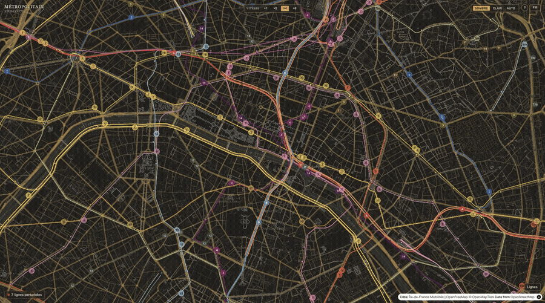

# Métropolitain

A real-time map of Paris's Métro, RER, Transilien, and Tram network — every train and every service disruption, live, sourced directly from [Île-de-France Mobilités'](https://www.iledefrance-mobilites.fr) own public transit API.

Live at [metropolitain.live](https://metropolitain.live).



## What it does

- Tracks live vehicle positions across all 44 rail/tram lines (16 Métro, 5 RER, 8 Transilien, 15 Tram), rendered as smoothly moving markers on a MapLibre GL map.
- Shows live service disruptions per line, grouped and ranked by severity, with French/English text.
- No login, no trip planning — pure real-time observation.

## How it works

A Node/Express backend polls IDFM's real-time API on a fixed schedule, computes each vehicle's position as a continuous schedule (not a raw GPS point — this feed doesn't have one), and pushes updates to every connected browser over a single shared WebSocket. The Next.js frontend interpolates each vehicle's position between schedule points on every animation frame, so motion reads as live and continuous rather than jumping every poll.

```
apps/
├── server/   Express + WebSocket backend — polls IDFM, broadcasts to clients
│   ├── src/
│   │   ├── config/       All environment variables, read once, in one place
│   │   ├── types/        Shared data types (VehicleState, DisruptionState, ...)
│   │   ├── idfmIngestion.ts   Real-time position + disruption fetching from IDFM
│   │   ├── network.ts    Loads line/station geometry, builds lookup tables
│   │   ├── geometry.ts   Polyline math (position-at-fraction, nearest-point, simplify)
│   │   ├── translate.ts  French→English translation via DeepL (falls back to MyMemory), disk-cached
│   │   └── index.ts      HTTP + WebSocket server, polling loops
│   └── data/*.geojson    Real line/branch geometry, extracted from IDFM's GTFS bundle
└── web/      Next.js frontend
    └── src/
        ├── config/       Client-side environment variables
        └── components/MetroMap.tsx   The whole map UI
```

No database — vehicle and disruption state is in-memory and rebuilt fresh from IDFM on restart. The one exception is the translation cache (French disruption text → English), which is written to a small JSON file on a named Docker volume so a redeploy doesn't force re-translating every distinct message from scratch.

## Getting started

**Prerequisites:**
- Node.js 20+
- A free [PRIM API key](https://prim.iledefrance-mobilites.fr) (IDFM's open data platform) — required, there is no mock/offline mode
- A free [DeepL API key](https://www.deepl.com/pro-api) — optional; without it, translation falls back to [MyMemory](https://mymemory.translated.net)'s free keyless API, and to French-only if that's unavailable too

```bash
git clone <this-repo>
cd paris-transit-live
npm install
```

Set up environment files from the templates:

```bash
cp apps/server/.env.example apps/server/.env
```

Fill in `PRIM_API_KEY` (and optionally `DEEPL_API_KEY`) in `apps/server/.env`. See that file for the full list of variables.

Run both apps in dev mode (separate terminals):

```bash
npm run dev --workspace=apps/server   # http://localhost:4001
npm run dev --workspace=apps/web      # http://localhost:3000
```

### Before you push

A [Lefthook](https://github.com/evilmartians/lefthook) `pre-push` hook builds both workspaces to catch type errors and build failures before they reach a branch. It installs itself automatically on `npm install` (via the root `prepare` script). No setup needed.

## Deployment

Runs as two Docker containers (see `docker-compose.yml` and each app's `Dockerfile`) behind nginx with Let's Encrypt TLS (`nginx/metropolitain.conf`). Production config lives in `env/server.env` (gitignored — see `env/server.env.example`).

## Data & licensing

- Static network data (lines, stations, shapes) and real-time data (positions, disruptions) both come from IDFM under their [open licenses](https://prim.iledefrance-mobilites.fr/en/licences) — attribution is required and is shown live on the map itself.
- This project's own code is MIT-licensed — see [LICENSE](LICENSE).

## Contributing

Issues and PRs welcome. Since this talks to a real, quota-limited third-party API, please don't lower the polling intervals in `apps/server/src/config/index.ts` without understanding IDFM's daily call budget (see the comments in `idfmIngestion.ts`) — a shared dev key can exhaust production's quota.

Found a real security issue? Please see [SECURITY.md](SECURITY.md) rather than opening a public issue.
